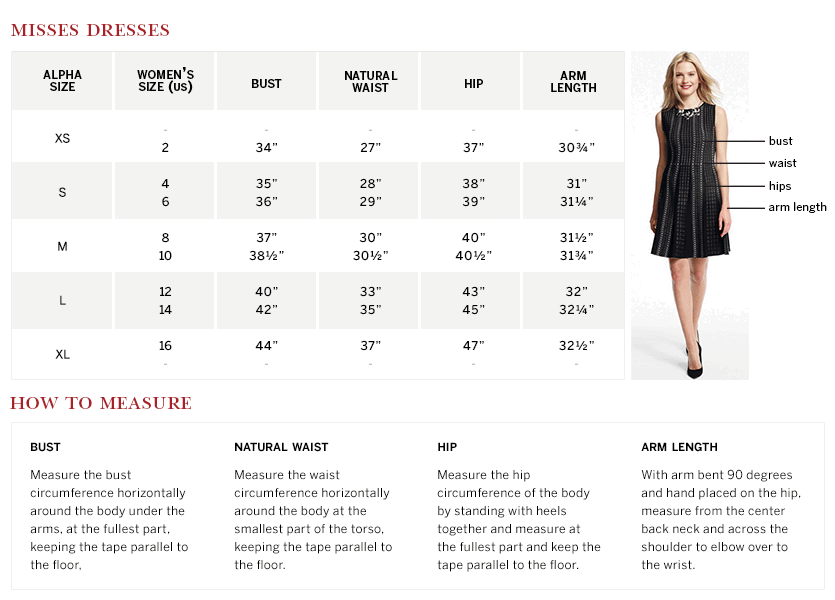
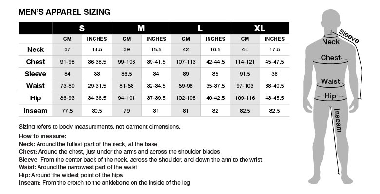

# Secret Sauce Size Chart Editor

Add, edit and view size charts of apparel brands with ease!

## Background

Size charts contain the measurements for each size label used by brands or designer for garments sold.
There are a large number of standard sizing systems around the world[1](#1)[2](#2)[3](#3).

Sizing is quite inconsistent and there can be great differences in fit and measurement among brands.
Size charts can help navigate the landscape when shopping online.

## Concepts

Size charts (also called size guides) are provided by manufacturers for their brands and can apply to
one or more apparel categories. Separate size charts exist for women and men.

### Dressbarn Misses Dresses Size Chart[4](#4)

### Black Diamond Men's Apparel Size Chart[5](#5)

## Contributing

Fork this repository and implement one or more features from the list below.
You can choose any database, framework, language, or technology.
Document your choices and provide instructions on how to get the project up and running.

Pull requests welcome!

## Features

There are no specific requirements. Discover size charts and come up with the right functionality
that you think will work best for the users.

### Basic features

 * [ ] Add new size chart with measurements for each size label
 * [ ] List size charts
 * [ ] Modify an existing size chart
 * [ ] Delete size chart
 
### Advanced features

 * [ ] Filter size charts by brand and other attributes
 * [ ] Import size chart from an external source (CSV, JSON, URL)
 * [ ] Paginate size charts
 * [ ] Support multiple measurement units (inch, cm)
 * [ ] Track source of size chart (URL, image)
 * [ ] Visualize measurements of one or more size charts

## License

All code, including contributions in GitHub forks and pull requests fall under the permissive [MIT license](LICENSE).

## References

<a name="1">1.</a> https://en.wikipedia.org/wiki/Clothing_sizes 
<a name="2">2.</a> https://en.wikipedia.org/wiki/US_standard_clothing_size 
<a name="3">3.</a> https://en.wikipedia.org/wiki/EN_13402 
<a name="4">4.</a> https://www.dressbarn.com/customer-service/size-charts 
<a name="5">5.</a> http://blackdiamondequipment.com/en/size-chart-apparel-mens-f13.html 
